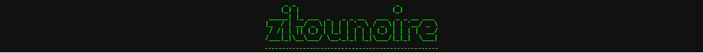

# Hey

<!--

# Hello, world!

Yeah I know.

I find "Hello, World!" too cheesy too.

"I don't have a lot of creativity" is a valid enough argument, so we'll stick with that for now.

**zitounoire/zitounoire** is a ✨ _special_ ✨ repository because its `README.md` (this file) appears on your GitHub profile.

Here are some ideas to get you started:

- 🔭 I’m currently working on ...
- 🌱 I’m currently learning ...
- 👯 I’m looking to collaborate on ...
- 🤔 I’m looking for help with ...
- 💬 Ask me about ...
- 📫 How to reach me: ...
- 😄 Pronouns: ...
- ⚡ Fun fact: ...
-->
